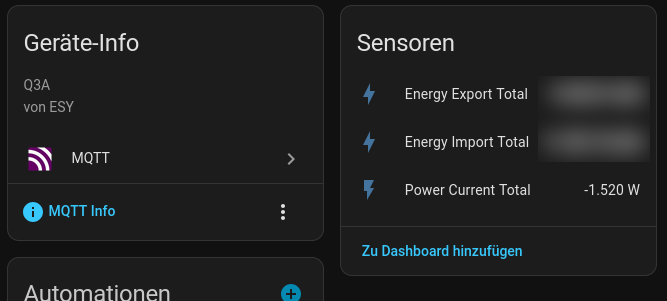
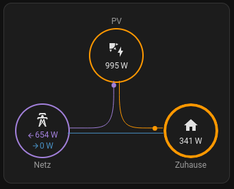

# sml2ha - SML Smart Meter to Home Assistant via MQTT

A native Rust implementation of the Smart Message Language (SML) protocol is provided to integrate smart meters (electronic household meters) into Home Assistant via MQTT Discovery.

## Project Description

The gap between modern electronic meters (with optical D0 interfaces) and home automation is bridged by this project. SML data frames are read from a serial port (e.g., via a USB-IR read head) and telemetry is published to Home Assistant. Robust frame synchronization and decoding are ensured by the use of the `sml_rs` library.

Manufacturer and model information is automatically decoded from the SML Server ID (FNN standard), ensuring that devices are correctly identified within Home Assistant. Supported manufacturers include EBZ, EMH, EasyMeter, APA, and Logarex.

This project, including this README, was completely written with AI assistance
(Gemini Flash/Pro). No manual code review has been performed. The status is
marked as `WorksForMe` 😀

## Disclaimer

> [!WARNING]
> This project was written completely with AI. No responsibility is taken for
> any damages or issues caused by the use of this software. DAMAGE TO YOUR
> SMART METER CAN BE CAUSED BY THIS SOFTWARE! IT SHOULD BE USED ONLY FOR
> EDUCATIONAL PURPOSES! A WARNING HAS BEEN ISSUED!
> 
> This project is **not affiliated** with any Smart Meter vendor or Home
> Assistant.

## Command Line Parameters

| Parameter | Short | Description |
| :--- | :--- | :--- |
| `--config` | `-c` | Path to the configuration file (default: `config.yml`) |
| `--help` | `-h` | Help information is displayed |

## Configuration Values

A YAML configuration file (`config.yml`) is utilized by the application:

```yaml
serial:
  port: "/dev/ttyUSB0"     # Path to the IR read head
  baud_rate: 9600          # Usually 9600 for SML

mqtt:
  host: "localhost"        # MQTT Broker address
  port: 1883               # MQTT Broker port
  client_id: "sml2ha"      # Unique client ID
  topic_prefix: "sml2ha"   # Prefix for MQTT topics

logging:
  debug: true              # Verbose console output is enabled
```

## Home Assistant Integration

MQTT Discovery is leveraged by this application, meaning the smart meter is automatically detected by Home Assistant as a new device once the application is initiated. The unique ID for each sensor is prefixed with the meter's serial number to prevent naming conflicts.

The following sensors are automatically registered:
- **Energy Import Total**: 1.8.0 counter (kWh)
- **Energy Export Total**: 2.8.0 counter (kWh)
- **Power Current Total**: 16.7.0 current total power (W)

A clean device page is created in Home Assistant by the integration, where the
telemetry data such as `Energy Import Total`, `Energy Export Total` and `Power
Current Total` are shown.



### Visualization

For a great overview of the energy flow, the use of the [Power Flow Card
Plus](https://github.com/flixlix/power-flow-card-plus) is recommended.



#### Example Dashboard Configuration

The following configuration can be used to integrate the Power Flow Card Plus
with the smart meter (the serial number `12345678901234567890` should be
replaced with the actual smartmeters serial number):

```yaml
type: custom:power-flow-card-plus
entities:
  grid:
    entity: sensor.sml_12345678901234567890_power_current_total
  solar:
    entity: sensor.sma_1234567890_pac
```

## Docker

`sml2ha` can be executed as a Docker container.

### The Image is Built
```bash
docker build -t sml2ha .
```

## Docker Compose Example

The serial device must be mapped into the container.

```yaml
services:
  sml2ha:
    image: sml2ha:latest
    restart: unless-stopped
    devices:
      - "/dev/ttyUSB_easymeter:/dev/ttyUSB_easymeter"
    volumes:
      - "./config.yml:/app/config.yml:ro"
```

## Pull Requests are Welcomed

Issues can be opened or pull requests can be submitted. If time allows, they will
be reviewed.

## Credits

Thanks to everybody who contributed to a part that is used by this project or
was used to develop it.

## License

This project is licensed under the **MIT License**.
